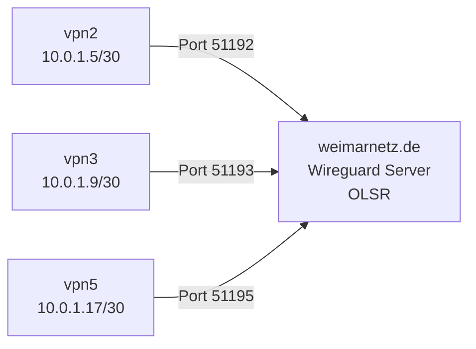

vpnconfig
=========

VPN Serverconfig für Weimarnetz

Einrichtung
===========

siehe [Anleitung](Setup.md)

VPN zwischen den Servern
=======================

Da sich tinc zusammen mit OLSR als untauglich erwiesen hat, wurde die VPN-Verbindung zwischen den Servern zuerst auf OpenVPN und letztendlich auf wireguard umgestellt. Jeder VPN-Server baut mit dem zentralen Wireguard-Server eine eigene Verbindung in einem eigenen Netzwerk auf. Der zentrale Wireguard-Server verbindet diese Netzwerke mittels OLSR.



Nachteilig bei Wireguard ist im Moment noch, dass auf dem zentralen Server für jede Verbindung eine Route (Allowed IPs) für ein IP-Netz angelegt wird. Das ist natürlich nicht überlappend möglich und der momentane Workaround ist, dass die Interfaces unterschiedliche große Netze beanspruchen (10.63.0.0/16, 10.62.0.0/15, etc.). Evtl. lässt sich das lösen, indem man mit IP Rules arbeitet.

Einrichtung
-----------

1. Wireguard installieren mit `apt install wireguard`
2. Zertifikate in `/etc/wireguard` erzeugen: `wg genkey | tee privatekey | wg pubkey > publickey`
3. Clientkonfiguration `wg0-innercity.conf` nach `/etc/wireguard` kopieren und privatekey sowie IP-Adressen anpassen. Der Public Key muss vom zentralen Server sein
4. Auf dem zentralen Server muss eine Config mit dem Public Key angelegt werden.

JSON-Format
===========
Beschreibt die möglichen Informationen und Felder, die ein Client erwartet:

```
{
  "server" : "DNS-Name des Servers",
  "maxmtu" : "Maximale MTU, die Server anbieten kann",
  "port_vtun_nossl_nolzo" : "Port der VTUN-Instanz, die ohne ssl und ohne lzo kompiliert wurde",
  "port_vtun_nossl_lzo" : "Port der VTUN-Instanz, die ohne ssl aber mit lzo kompiliert wurde",
  "clients" : "Anzahl der verbundenen Clients, wird vom php-script generiert"
}
```
IP-Schema
=========
Jeder VPN-Server bekommt ein /30-Netz aus dem Bereich der Knotennummer 1 (10.63.1.0/26) für das
dummy/ungenutze VTUN-Haupt-Interface. (MainIP im OLSR-jargon)

```
maximal 12 Server:
vpn1: 10.63.1.0/30
vpn2: 10.63.1.4/30
vpn3: 10.63.1.8/30
vpn4: 10.63.1.12/30
vpn5: 10.63.1.16/30
vpn6: 10.63.1.20/30
vpn7: 10.63.1.24/30
vpn8: 10.63.1.28/30
vpn9: 10.63.1.32/30
vpn10: 10.63.1.36/30
vpn11: 10.63.1.40/30
vpn12: 10.63.1.44/30
       10.63.1.48...62/28 (fuer vpnvpn, siehe unten)
```

Für die Verbindung der VPN-Server untereinander bauen wir ein tinc-Netz auf,
das die Adressen aus dem letzten Netzbereich verwendet.

```
vpnvpn1:    10.63.1.1/30
vpnvpn2:    10.63.1.5/30
vpnvpn3:    10.63.1.9/30
vpnvpn4:    10.63.1.13/30
vpnvpn5:    10.63.1.17/30
```

Die Verteilung der IPv6-Adressen ist im Wiki unter http://wireless.subsignal.org/index.php?title=IP-System#Wie_kann_die_Verteilung_aussehen beschrieben.

momentan ist folgendes aktiv (id: domain = ip -> admin)
```
vpn1: weimarnetz.de = 77.87.48.19 -> Andi
vpn2: 2.v.weimarnetz.de = 176.9.46.7 -> Andi/UFO
vpn3: weimarnetz/test.vm = 77.87.48.35 -> Andi
vpn5: hosteurope = 80.237.195.246 -> Andi 
```

Konzept
=======

1. VPN-Server
  * Wir numerieren die DNS-Namen unserer Server durch,
vpn1.weimarnetz.de .. vpnX.weimarnetz.de
  * auf jedem der Server legen wir für jeden Router die Konfiguration
schon im Vorfeld an, 1000 Tap-Devices, 1000 OLSR-Devices. Somit kann
jeder Router ohne Neustart des VPNs auf dem Rootserver eine Verbindung
aufbauen, die anderen Verbindungen werden nicht gestört
2. Router
  * das Tap-Device tap0 und die OLSR-Config wird standardmäßig
eingerichtet, damit muss auch am Router nichts neu gestartet werden
nachdem die Verbindung hergestellt wurde
  * Durch die Anlage der Devices auf dem Rootserver ist auch die
Registrierung nicht mehr notwendig
3. Ablauf
  1. Falls ein direkter Internetzugang vorliegt: Router pingt mit timeout
von 250ms vpn1-vpn10 durch, dauert also 2,5 Sekunden. Der Server mit der
schnellsten Antwortzeit gewinnt. 10 VPN-Server könnten wir
perspektivisch einsetzen. Per DNS kann man die Namen auf andere Server
zeigen lassen
  2. Der Router muss sich zwar nicht registrieren, fragt den Server aber
nach seiner Konfiguration. So können wir die Router schön dumm lassen
und müssen kein Firmwareupdate machen, falls sich etwas ändert. Die
Antwort kann so aussehen:

{
  "server" : "vpn1.weimarnetz.de",
  "port_vtun_nossl_nolzo": "5001",
  "port_vtun_nossl_lzo": "5002",
  "port_vtun_ssl_lzo": "5003",
  "maxmtu": "1452",
  "clients": "23",
  "country": "DE",
}

Es können auch noch weitere Informationen des Servers aufgenommen
werden, mir fallen im Moment nur keine weiteren ein. Der country-code
wird von http://en.wikipedia.org/wiki/ISO_3166-2 genommen. Auf diese
Weise hat der Nutzer evtl. die Chance ein nichtdeutsches Youtube zu bekommen.
  3. Danach verbindet sich der Router wie gehabt und setzt die Routen und
alles wird gut.
