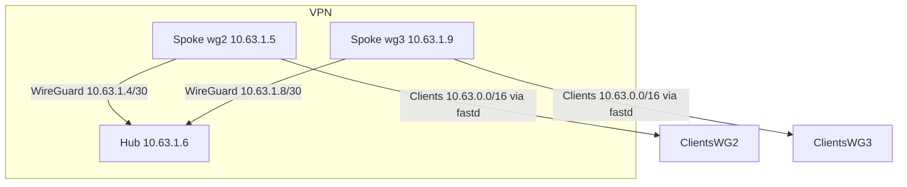

# VPN-Setup mit WireGuard und Policy Routing 🌐🔐📡

Dieses Setup beschreibt eine sternförmige VPN-Infrastruktur, bei der mehrere sogenannte „Spokes“ über WireGuard mit einem zentralen „Hub“ verbunden sind. Jeder Spoke kann theoretisch die gleichen Subnetze haben, da Clients beim Verbindungsaufbau per Round-Robin verteilt werden. Für das Routing wird Policy Routing eingesetzt. 🛣️🧭🗺️

---

## Übersicht 🖼️📊📎


```mermaid
graph TD
  subgraph VPN
    Hub[Hub 10.63.1.6]
    WG2[Spoke wg2 10.63.1.5]
    WG3[Spoke wg3 10.63.1.9]
  end

  WG2 -->|WireGuard 10.63.1.4/30| Hub
  WG3 -->|WireGuard 10.63.1.8/30| Hub

  WG2 -->|Clients 10.63.0.0/16 via fastd| ClientsWG2
  WG3 -->|Clients 10.63.0.0/16 via fastd| ClientsWG3
```


## IP-Adressübersicht 🗂️📡🖥️

| Zweck                      | IP-Bereich   | Bemerkung                          |
| -------------------------- | ------------ | ---------------------------------- |
| fastd Interface auf Spokes | 10.63.0.0/16 | Clients über fastd, z.B. 10.63.0.x |
| WireGuard Tunnel Spoke-Hub | 10.63.1.x/30 | Je Spoke ein /30-Netz für Tunnel   |


## Routing Tables anlegen ⚙️🛣️🧾

Damit Policy Routing funktioniert, müssen benutzerdefinierte Routing-Tabellen für die Spokes angelegt werden. Dies geschieht in der Datei `/etc/iproute2/rt_tables`:

```bash
echo "200 wg_2" | sudo tee -a /etc/iproute2/rt_tables
echo "201 wg_3" | sudo tee -a /etc/iproute2/rt_tables
```

Hierbei steht `200` und `201` für die Priorität bzw. Nummer der Tabelle, `wg_2` und `wg_3` sind frei wählbare Namen, die dann in den WireGuard-Konfigurationen verwendet werden.

## Schlüsselgenerierung 🔑🧾📥

Jeder Knoten benötigt ein eigenes Schlüsselpaar: 🔁📋🧰

```bash
wg genkey | tee privatekey | wg pubkey > publickey
```

* `privatekey`: bleibt auf dem jeweiligen Host
* `publickey`: wird im Peer-Abschnitt auf dem jeweils anderen Knoten eingetragen

## Beispielkonfiguration: Spoke 💻🌍📡

```ini
[Interface]
PrivateKey = <PRIVATE_KEY>
Address = 10.63.1.5/30
Table = off

[Peer]
PublicKey = <HUB_PUBLIC_KEY>
AllowedIPs = 10.63.1.4/30, 10.63.0.0/16, 10.64.0.0/16
Endpoint = <HUB_PUBLIC_IP>:51192
PersistentKeepalive = 20
```

* `Table = off`: verhindert, dass WireGuard automatisch Routen in den main table schreibt 🛑📉📘

---

## Beispielkonfiguration: Hub (mit Policy Routing) 🖥️🏛️🗂️

```ini
[Interface]
PrivateKey = <PRIVATE_KEY>
Address = 10.63.1.6/30
Table = off
PostUp = ip route add 10.63.0.0/16 dev wg2 table wg_2
PostUp = ip route add 10.64.0.0/16 dev wg2 table wg_2
PostUp = ip rule add from 10.63.1.6/32 lookup wg_2 priority 100
PostDown = ip rule del from 10.63.1.6/32 lookup wg_2 priority 100
PostDown = ip route del 10.63.0.0/16 dev wg2 table wg_2
PostDown = ip route del 10.64.0.0/16 dev wg2 table wg_2
ListenPort = 51192

[Peer]
PublicKey = <SPOKE_PUBLIC_KEY>
AllowedIPs = 10.63.1.5/32, 10.63.1.4/30, 10.63.0.0/16, 10.64.0.0/16
Endpoint = <SPOKE_PUBLIC_IP>:PORT
```

* Auch hier wird `Table = off` genutzt. 🚫🗃️🔧
* Das Routing geschieht ausschließlich über benutzerdefinierte Routingtabellen (`wg_2`, `wg_3`, …). 🗺️📄📈
* Die `ip rule`-Einträge sorgen dafür, dass ausgehender Verkehr der Interface-IP (z. B. `10.63.1.6`) die passende Routingtabelle nutzt. 🧭📍📌


## Hinweise zur Routing-Konfiguration 📝🛠️🔍

* Die Routen für das WireGuard-Transfernetz (z. B. `10.63.1.4/30`) müssen manuell gesetzt werden, wenn `Table = off` verwendet wird. 🧮👷🧱
* Der `AllowedIPs`-Eintrag dient sowohl als Access Control als auch zur Routing-Entscheidung. Mit `Table = off` kann man hier großzügiger sein, ohne Konflikte im `main` Routing Table zu erzeugen. 🛑🗺️🔀
* OLSR schreibt seine dynamischen Routen weiterhin in `main` – das kann beibehalten werden. 🔄📘✔️

## fastd — Einfaches Layer-2 VPN für die Spokes 🔄🔗🎛️

`fastd` ist ein einfaches, schnelles Layer-2 VPN, das in vielen Freifunk-Netzwerken als Tunnel für die eigentlichen Clients genutzt wird. Über `fastd` verbinden sich die Clients der Spokes, und über WireGuard werden die Spokes untereinander (zum Hub) verbunden.

### Beispiel fastd-Konfiguration (Spoke)

```bash
# /etc/fastd/fastd.conf
bind 0.0.0.0:10000;
interface "fastd_mesh";
user "nobody";
mode tap;
method "null";
method "null@l2tp";
#offload l2tp yes;
mtu 1280;
secret "...";
log level debug;
#folgende Zeile sorgt dafuer das jeder Peer akzeptiert wird
on verify "logger $PEER_NAME && true";
persist interface no;
include peers from "peers";

on up "
  logger \"$LOCAL_ADDRESS peer: $PEER_NAME $PEER_KEY\"
  ip a a <<IP_ADDRESS>>/16 dev $INTERFACE
  ip link set up fastd_mesh
";
on down "
  logger \"$LOCAL_ADDRESS peer: $PEER_NAME $PEER_KEY\"
  ip a d <<IP_ADDRESS>>/16 dev $INTERFACE
  ip link set down fastd_mesh
";

```
<<IP_ADDRESS>> muss durch die für den jeweiligen Spoke gültige Adresse ersetzt werden (10.63.0.x/16).

### fastd starten / stoppen

```bash
systemctl start fastd
systemctl enable fastd
systemctl status fastd
```

## Weiteres 📚🧩⏳

* OLSR-Config
